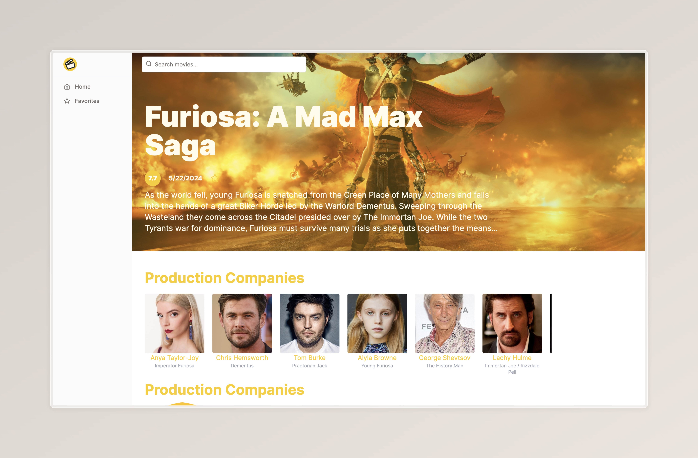
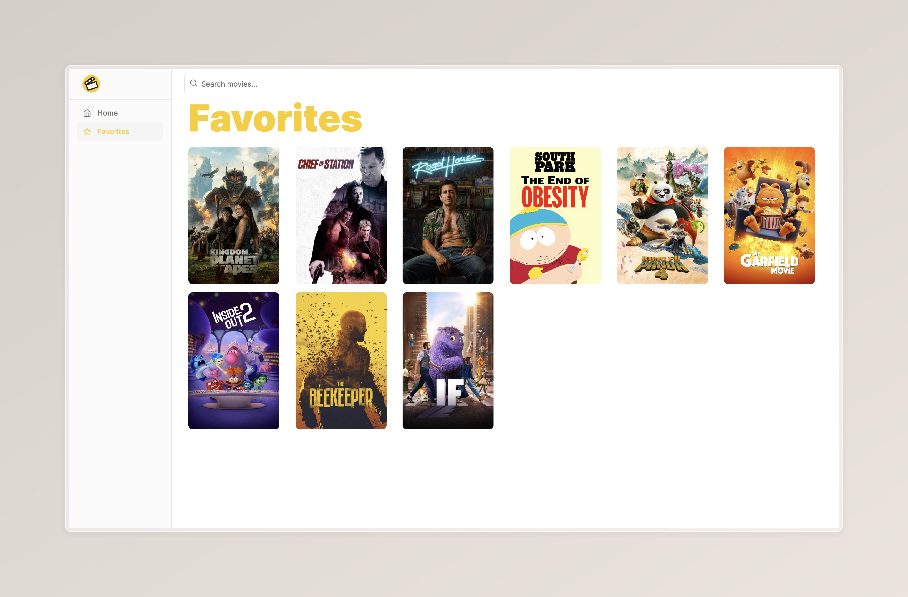

# Movie App - Frontend Challenge

Landing page to a movie app to show the most popular movies categorized by genre for a Fronted Challenge.

## Tech Stack

### Client
- Next 14
- Shadcn/ui
- Tailwind css

### Backend
- TMDB Api

## Roadmap

- [x] Create a initial configuration
- [x] Add api connection
- [x] Create a layout for the landing page
- [x] Create a list of genre movies
- [x] Create a movie card
- [x] Create a movie information page
- [x] Add search functionality
- [x] Add tests

## Run Locally

Clone the project

```bash
  git clone https://github.com/DaniPoot/frontend_challenge
```

Go to the project directory

```bash
  cd movie-app
```

Install dependencies

```bash
  pnpm install
```

Start the server

```bash
  pnpm run start
```


## Environment Variables

To run this project, you will need to add the following environment variables to your .env file

```
NEXT_PUBLIC_IMDB_BASE_URL="https://api.themoviedb.org/3"
NEXT_PUBLIC_IMDB_API_KEY="IMDB_API_KEY"
```


## Running Tests

To run tests, run the following command

```bash
  pnpm run test
```


## Demo

[Movie App](https://frontend-challenge-lovat-tau.vercel.app/)


## Screenshots





