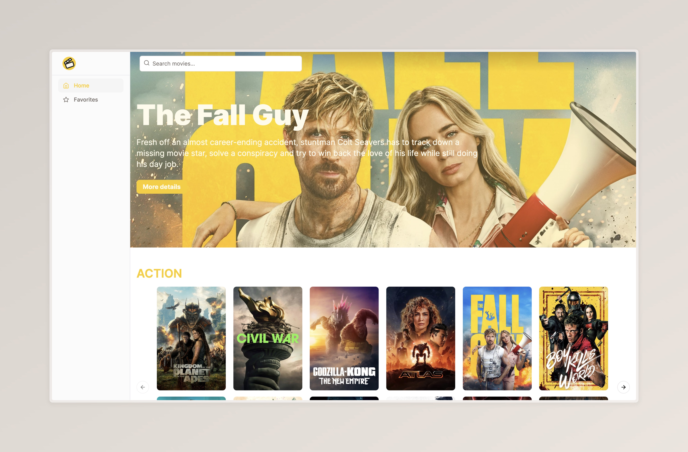

# Movie App - Frontend Challenge

Landing page to a movie app to show the most popular movies categorized by genre for a Fronted Challenge.

## Tech Stack

### Client
- Next 14
- Shadcn/ui
- Tailwind css

### Backend
- TMDB Api

## Roadmap

- [x] Create a initial configuration
- [x] Add api connection
- [x] Create a layout for the landing page
- [x] Create a list of genre movies
- [x] Create a movie card
- [x] Create a movie information page
- [x] Add search functionality
- [x] Add tests

## Run Locally

Clone the project

```bash
  git clone https://github.com/DaniPoot/frontend_challenge
```

Go to the project directory

```bash
  cd movie-app
```

Install dependencies

```bash
  pnpm install
```

Start the server

```bash
  pnpm run start
```


## Environment Variables

To run this project, you will need to add the following environment variables to your .env file

```
NEXT_PUBLIC_IMDB_BASE_URL="https://api.themoviedb.org/3"
NEXT_PUBLIC_IMDB_API_KEY="IMDB_API_KEY"
```


## Running Tests

To run tests, run the following command

```bash
  pnpm run test
```


## Demo

[Movie App](https://frontend-challenge-lovat-tau.vercel.app/)


## Screenshots




# Architecture

This is a section to explain the second part of the challenge:

For the hypothetical scenario of making our application more scalable, I'd start by caching the information shown on the homepage. This would help users load the page more quickly since they wouldn't have to fetch the same data over and over again. Also, I'd focus on improving the loading speed of images. Some of them take too long to appear, and others don't load smoothly. Implementing lazy loading for images could solve this issue. Additionally, right now, we store favorite items in memory, which could be risky. Switching to a database to store this information securely would be a smart move. Looking ahead, I'd also suggest we invest time in building reusable components. By structuring our codebase in a modular way, we can save time and effort in future development and ensure consistency across different parts of the application. Moreover, as we expand our application's capabilities, it would be beneficial to plan for connecting to future APIs. This proactive approach will enable seamless integration of new features and services as our application evolves.